# CREDIT CARD FRAUD DETECTION PROJECT
## Introduction
 Our research question for the following dataset is the following:

 **How does a unbalanced dataset (99.828% Class 1 (not fraud) | 0.172% Class 2 (fraud)) affect different machine learning and classificiation models in comparison to a artificially balanced dataset?**

 During this project we do the following;
<ol>
    <li><b>Visualize the Dataset</b> <ul>
        <li>Amount feature</li>
        <li>Time feature</li>
    </ul></li>
    <li><b>Visualize and understand significant features</b></li>
    <li><b>Build baseline model</b></li>
    <li><b>Perform preproccessing</b>
        <ul>
            <li>Rescaling</li>
            <li>Upsample and evaluate upsampling/downsampling methods</li>
        </ul>
    </li>
    <li><b>Build multiple models </b>
        <ul>
            <li>Naive bayesian</li>
            <li>K-Nearest-Neigbours</li>
            <li>Neural network</li>
        </ul>
    </li>
    <li><b>Evaluate models</b>
        <ul>
            <li>Confusion Matrix</li>
            <li>Classification Report</li>
        </ul>
    </li>
    <li>
        <b>Conclusion</b>
    </li>
</ol>

### Basic imports

    2022-11-18 22:32:41.098717: I tensorflow/core/platform/cpu_feature_guard.cc:193] This TensorFlow binary is optimized with oneAPI Deep Neural Network Library (oneDNN) to use the following CPU instructions in performance-critical operations:  AVX2 FMA
    To enable them in other operations, rebuild TensorFlow with the appropriate compiler flags.
    2022-11-18 22:32:41.227679: W tensorflow/stream_executor/platform/default/dso_loader.cc:64] Could not load dynamic library 'libcudart.so.11.0'; dlerror: libcudart.so.11.0: cannot open shared object file: No such file or directory
    2022-11-18 22:32:41.227699: I tensorflow/stream_executor/cuda/cudart_stub.cc:29] Ignore above cudart dlerror if you do not have a GPU set up on your machine.
    2022-11-18 22:32:41.251082: E tensorflow/stream_executor/cuda/cuda_blas.cc:2981] Unable to register cuBLAS factory: Attempting to register factory for plugin cuBLAS when one has already been registered
    2022-11-18 22:32:41.801572: W tensorflow/stream_executor/platform/default/dso_loader.cc:64] Could not load dynamic library 'libnvinfer.so.7'; dlerror: libnvinfer.so.7: cannot open shared object file: No such file or directory
    2022-11-18 22:32:41.801685: W tensorflow/stream_executor/platform/default/dso_loader.cc:64] Could not load dynamic library 'libnvinfer_plugin.so.7'; dlerror: libnvinfer_plugin.so.7: cannot open shared object file: No such file or directory
    2022-11-18 22:32:41.801695: W tensorflow/compiler/tf2tensorrt/utils/py_utils.cc:38] TF-TRT Warning: Cannot dlopen some TensorRT libraries. If you would like to use Nvidia GPU with TensorRT, please make sure the missing libraries mentioned above are installed properly.

Load in the creditcard csv data using pandas.

Printing the header and first few rows to get a look at the data. Also printing the shape and info

Retrieve key statistical information about the data.

<table id="T_d1650">
  <thead>
    <tr>
      <th class="blank level0" >&nbsp;</th>
      <th id="T_d1650_level0_col0" class="col_heading level0 col0" >Time</th>
      <th id="T_d1650_level0_col1" class="col_heading level0 col1" >V1</th>
      <th id="T_d1650_level0_col2" class="col_heading level0 col2" >V2</th>
      <th id="T_d1650_level0_col3" class="col_heading level0 col3" >V3</th>
      <th id="T_d1650_level0_col4" class="col_heading level0 col4" >V4</th>
      <th id="T_d1650_level0_col5" class="col_heading level0 col5" >V5</th>
      <th id="T_d1650_level0_col6" class="col_heading level0 col6" >V6</th>
      <th id="T_d1650_level0_col7" class="col_heading level0 col7" >V7</th>
      <th id="T_d1650_level0_col8" class="col_heading level0 col8" >V8</th>
      <th id="T_d1650_level0_col9" class="col_heading level0 col9" >V9</th>
      <th id="T_d1650_level0_col10" class="col_heading level0 col10" >V10</th>
      <th id="T_d1650_level0_col11" class="col_heading level0 col11" >V11</th>
      <th id="T_d1650_level0_col12" class="col_heading level0 col12" >V12</th>
      <th id="T_d1650_level0_col13" class="col_heading level0 col13" >V13</th>
      <th id="T_d1650_level0_col14" class="col_heading level0 col14" >V14</th>
      <th id="T_d1650_level0_col15" class="col_heading level0 col15" >V15</th>
      <th id="T_d1650_level0_col16" class="col_heading level0 col16" >V16</th>
      <th id="T_d1650_level0_col17" class="col_heading level0 col17" >V17</th>
      <th id="T_d1650_level0_col18" class="col_heading level0 col18" >V18</th>
      <th id="T_d1650_level0_col19" class="col_heading level0 col19" >V19</th>
      <th id="T_d1650_level0_col20" class="col_heading level0 col20" >V20</th>
      <th id="T_d1650_level0_col21" class="col_heading level0 col21" >V21</th>
      <th id="T_d1650_level0_col22" class="col_heading level0 col22" >V22</th>
      <th id="T_d1650_level0_col23" class="col_heading level0 col23" >V23</th>
      <th id="T_d1650_level0_col24" class="col_heading level0 col24" >V24</th>
      <th id="T_d1650_level0_col25" class="col_heading level0 col25" >V25</th>
      <th id="T_d1650_level0_col26" class="col_heading level0 col26" >V26</th>
      <th id="T_d1650_level0_col27" class="col_heading level0 col27" >V27</th>
      <th id="T_d1650_level0_col28" class="col_heading level0 col28" >V28</th>
      <th id="T_d1650_level0_col29" class="col_heading level0 col29" >Amount</th>
      <th id="T_d1650_level0_col30" class="col_heading level0 col30" >Class</th>
    </tr>
  </thead>
  <tbody>
    <tr>
      <th id="T_d1650_level0_row0" class="row_heading level0 row0" >count</th>
      <td id="T_d1650_row0_col0" class="data row0 col0" >284807.000000</td>
      <td id="T_d1650_row0_col1" class="data row0 col1" >284807.000000</td>
      <td id="T_d1650_row0_col2" class="data row0 col2" >284807.000000</td>
      <td id="T_d1650_row0_col3" class="data row0 col3" >284807.000000</td>
      <td id="T_d1650_row0_col4" class="data row0 col4" >284807.000000</td>
      <td id="T_d1650_row0_col5" class="data row0 col5" >284807.000000</td>
      <td id="T_d1650_row0_col6" class="data row0 col6" >284807.000000</td>
      <td id="T_d1650_row0_col7" class="data row0 col7" >284807.000000</td>
      <td id="T_d1650_row0_col8" class="data row0 col8" >284807.000000</td>
      <td id="T_d1650_row0_col9" class="data row0 col9" >284807.000000</td>
      <td id="T_d1650_row0_col10" class="data row0 col10" >284807.000000</td>
      <td id="T_d1650_row0_col11" class="data row0 col11" >284807.000000</td>
      <td id="T_d1650_row0_col12" class="data row0 col12" >284807.000000</td>
      <td id="T_d1650_row0_col13" class="data row0 col13" >284807.000000</td>
      <td id="T_d1650_row0_col14" class="data row0 col14" >284807.000000</td>
      <td id="T_d1650_row0_col15" class="data row0 col15" >284807.000000</td>
      <td id="T_d1650_row0_col16" class="data row0 col16" >284807.000000</td>
      <td id="T_d1650_row0_col17" class="data row0 col17" >284807.000000</td>
      <td id="T_d1650_row0_col18" class="data row0 col18" >284807.000000</td>
      <td id="T_d1650_row0_col19" class="data row0 col19" >284807.000000</td>
      <td id="T_d1650_row0_col20" class="data row0 col20" >284807.000000</td>
      <td id="T_d1650_row0_col21" class="data row0 col21" >284807.000000</td>
      <td id="T_d1650_row0_col22" class="data row0 col22" >284807.000000</td>
      <td id="T_d1650_row0_col23" class="data row0 col23" >284807.000000</td>
      <td id="T_d1650_row0_col24" class="data row0 col24" >284807.000000</td>
      <td id="T_d1650_row0_col25" class="data row0 col25" >284807.000000</td>
      <td id="T_d1650_row0_col26" class="data row0 col26" >284807.000000</td>
      <td id="T_d1650_row0_col27" class="data row0 col27" >284807.000000</td>
      <td id="T_d1650_row0_col28" class="data row0 col28" >284807.000000</td>
      <td id="T_d1650_row0_col29" class="data row0 col29" >284807.000000</td>
      <td id="T_d1650_row0_col30" class="data row0 col30" >284807.000000</td>
    </tr>
    <tr>
      <th id="T_d1650_level0_row1" class="row_heading level0 row1" >mean</th>
      <td id="T_d1650_row1_col0" class="data row1 col0" >94813.860000</td>
      <td id="T_d1650_row1_col1" class="data row1 col1" >0.000000</td>
      <td id="T_d1650_row1_col2" class="data row1 col2" >0.000000</td>
      <td id="T_d1650_row1_col3" class="data row1 col3" >-0.000000</td>
      <td id="T_d1650_row1_col4" class="data row1 col4" >0.000000</td>
      <td id="T_d1650_row1_col5" class="data row1 col5" >0.000000</td>
      <td id="T_d1650_row1_col6" class="data row1 col6" >0.000000</td>
      <td id="T_d1650_row1_col7" class="data row1 col7" >-0.000000</td>
      <td id="T_d1650_row1_col8" class="data row1 col8" >0.000000</td>
      <td id="T_d1650_row1_col9" class="data row1 col9" >-0.000000</td>
      <td id="T_d1650_row1_col10" class="data row1 col10" >0.000000</td>
      <td id="T_d1650_row1_col11" class="data row1 col11" >0.000000</td>
      <td id="T_d1650_row1_col12" class="data row1 col12" >-0.000000</td>
      <td id="T_d1650_row1_col13" class="data row1 col13" >0.000000</td>
      <td id="T_d1650_row1_col14" class="data row1 col14" >0.000000</td>
      <td id="T_d1650_row1_col15" class="data row1 col15" >0.000000</td>
      <td id="T_d1650_row1_col16" class="data row1 col16" >0.000000</td>
      <td id="T_d1650_row1_col17" class="data row1 col17" >-0.000000</td>
      <td id="T_d1650_row1_col18" class="data row1 col18" >0.000000</td>
      <td id="T_d1650_row1_col19" class="data row1 col19" >0.000000</td>
      <td id="T_d1650_row1_col20" class="data row1 col20" >0.000000</td>
      <td id="T_d1650_row1_col21" class="data row1 col21" >0.000000</td>
      <td id="T_d1650_row1_col22" class="data row1 col22" >-0.000000</td>
      <td id="T_d1650_row1_col23" class="data row1 col23" >0.000000</td>
      <td id="T_d1650_row1_col24" class="data row1 col24" >0.000000</td>
      <td id="T_d1650_row1_col25" class="data row1 col25" >0.000000</td>
      <td id="T_d1650_row1_col26" class="data row1 col26" >0.000000</td>
      <td id="T_d1650_row1_col27" class="data row1 col27" >-0.000000</td>
      <td id="T_d1650_row1_col28" class="data row1 col28" >-0.000000</td>
      <td id="T_d1650_row1_col29" class="data row1 col29" >88.350000</td>
      <td id="T_d1650_row1_col30" class="data row1 col30" >0.000000</td>
    </tr>
    <tr>
      <th id="T_d1650_level0_row2" class="row_heading level0 row2" >std</th>
      <td id="T_d1650_row2_col0" class="data row2 col0" >47488.150000</td>
      <td id="T_d1650_row2_col1" class="data row2 col1" >1.960000</td>
      <td id="T_d1650_row2_col2" class="data row2 col2" >1.650000</td>
      <td id="T_d1650_row2_col3" class="data row2 col3" >1.520000</td>
      <td id="T_d1650_row2_col4" class="data row2 col4" >1.420000</td>
      <td id="T_d1650_row2_col5" class="data row2 col5" >1.380000</td>
      <td id="T_d1650_row2_col6" class="data row2 col6" >1.330000</td>
      <td id="T_d1650_row2_col7" class="data row2 col7" >1.240000</td>
      <td id="T_d1650_row2_col8" class="data row2 col8" >1.190000</td>
      <td id="T_d1650_row2_col9" class="data row2 col9" >1.100000</td>
      <td id="T_d1650_row2_col10" class="data row2 col10" >1.090000</td>
      <td id="T_d1650_row2_col11" class="data row2 col11" >1.020000</td>
      <td id="T_d1650_row2_col12" class="data row2 col12" >1.000000</td>
      <td id="T_d1650_row2_col13" class="data row2 col13" >1.000000</td>
      <td id="T_d1650_row2_col14" class="data row2 col14" >0.960000</td>
      <td id="T_d1650_row2_col15" class="data row2 col15" >0.920000</td>
      <td id="T_d1650_row2_col16" class="data row2 col16" >0.880000</td>
      <td id="T_d1650_row2_col17" class="data row2 col17" >0.850000</td>
      <td id="T_d1650_row2_col18" class="data row2 col18" >0.840000</td>
      <td id="T_d1650_row2_col19" class="data row2 col19" >0.810000</td>
      <td id="T_d1650_row2_col20" class="data row2 col20" >0.770000</td>
      <td id="T_d1650_row2_col21" class="data row2 col21" >0.730000</td>
      <td id="T_d1650_row2_col22" class="data row2 col22" >0.730000</td>
      <td id="T_d1650_row2_col23" class="data row2 col23" >0.620000</td>
      <td id="T_d1650_row2_col24" class="data row2 col24" >0.610000</td>
      <td id="T_d1650_row2_col25" class="data row2 col25" >0.520000</td>
      <td id="T_d1650_row2_col26" class="data row2 col26" >0.480000</td>
      <td id="T_d1650_row2_col27" class="data row2 col27" >0.400000</td>
      <td id="T_d1650_row2_col28" class="data row2 col28" >0.330000</td>
      <td id="T_d1650_row2_col29" class="data row2 col29" >250.120000</td>
      <td id="T_d1650_row2_col30" class="data row2 col30" >0.040000</td>
    </tr>
    <tr>
      <th id="T_d1650_level0_row3" class="row_heading level0 row3" >min</th>
      <td id="T_d1650_row3_col0" class="data row3 col0" >0.000000</td>
      <td id="T_d1650_row3_col1" class="data row3 col1" >-56.410000</td>
      <td id="T_d1650_row3_col2" class="data row3 col2" >-72.720000</td>
      <td id="T_d1650_row3_col3" class="data row3 col3" >-48.330000</td>
      <td id="T_d1650_row3_col4" class="data row3 col4" >-5.680000</td>
      <td id="T_d1650_row3_col5" class="data row3 col5" >-113.740000</td>
      <td id="T_d1650_row3_col6" class="data row3 col6" >-26.160000</td>
      <td id="T_d1650_row3_col7" class="data row3 col7" >-43.560000</td>
      <td id="T_d1650_row3_col8" class="data row3 col8" >-73.220000</td>
      <td id="T_d1650_row3_col9" class="data row3 col9" >-13.430000</td>
      <td id="T_d1650_row3_col10" class="data row3 col10" >-24.590000</td>
      <td id="T_d1650_row3_col11" class="data row3 col11" >-4.800000</td>
      <td id="T_d1650_row3_col12" class="data row3 col12" >-18.680000</td>
      <td id="T_d1650_row3_col13" class="data row3 col13" >-5.790000</td>
      <td id="T_d1650_row3_col14" class="data row3 col14" >-19.210000</td>
      <td id="T_d1650_row3_col15" class="data row3 col15" >-4.500000</td>
      <td id="T_d1650_row3_col16" class="data row3 col16" >-14.130000</td>
      <td id="T_d1650_row3_col17" class="data row3 col17" >-25.160000</td>
      <td id="T_d1650_row3_col18" class="data row3 col18" >-9.500000</td>
      <td id="T_d1650_row3_col19" class="data row3 col19" >-7.210000</td>
      <td id="T_d1650_row3_col20" class="data row3 col20" >-54.500000</td>
      <td id="T_d1650_row3_col21" class="data row3 col21" >-34.830000</td>
      <td id="T_d1650_row3_col22" class="data row3 col22" >-10.930000</td>
      <td id="T_d1650_row3_col23" class="data row3 col23" >-44.810000</td>
      <td id="T_d1650_row3_col24" class="data row3 col24" >-2.840000</td>
      <td id="T_d1650_row3_col25" class="data row3 col25" >-10.300000</td>
      <td id="T_d1650_row3_col26" class="data row3 col26" >-2.600000</td>
      <td id="T_d1650_row3_col27" class="data row3 col27" >-22.570000</td>
      <td id="T_d1650_row3_col28" class="data row3 col28" >-15.430000</td>
      <td id="T_d1650_row3_col29" class="data row3 col29" >0.000000</td>
      <td id="T_d1650_row3_col30" class="data row3 col30" >0.000000</td>
    </tr>
    <tr>
      <th id="T_d1650_level0_row4" class="row_heading level0 row4" >25%</th>
      <td id="T_d1650_row4_col0" class="data row4 col0" >54201.500000</td>
      <td id="T_d1650_row4_col1" class="data row4 col1" >-0.920000</td>
      <td id="T_d1650_row4_col2" class="data row4 col2" >-0.600000</td>
      <td id="T_d1650_row4_col3" class="data row4 col3" >-0.890000</td>
      <td id="T_d1650_row4_col4" class="data row4 col4" >-0.850000</td>
      <td id="T_d1650_row4_col5" class="data row4 col5" >-0.690000</td>
      <td id="T_d1650_row4_col6" class="data row4 col6" >-0.770000</td>
      <td id="T_d1650_row4_col7" class="data row4 col7" >-0.550000</td>
      <td id="T_d1650_row4_col8" class="data row4 col8" >-0.210000</td>
      <td id="T_d1650_row4_col9" class="data row4 col9" >-0.640000</td>
      <td id="T_d1650_row4_col10" class="data row4 col10" >-0.540000</td>
      <td id="T_d1650_row4_col11" class="data row4 col11" >-0.760000</td>
      <td id="T_d1650_row4_col12" class="data row4 col12" >-0.410000</td>
      <td id="T_d1650_row4_col13" class="data row4 col13" >-0.650000</td>
      <td id="T_d1650_row4_col14" class="data row4 col14" >-0.430000</td>
      <td id="T_d1650_row4_col15" class="data row4 col15" >-0.580000</td>
      <td id="T_d1650_row4_col16" class="data row4 col16" >-0.470000</td>
      <td id="T_d1650_row4_col17" class="data row4 col17" >-0.480000</td>
      <td id="T_d1650_row4_col18" class="data row4 col18" >-0.500000</td>
      <td id="T_d1650_row4_col19" class="data row4 col19" >-0.460000</td>
      <td id="T_d1650_row4_col20" class="data row4 col20" >-0.210000</td>
      <td id="T_d1650_row4_col21" class="data row4 col21" >-0.230000</td>
      <td id="T_d1650_row4_col22" class="data row4 col22" >-0.540000</td>
      <td id="T_d1650_row4_col23" class="data row4 col23" >-0.160000</td>
      <td id="T_d1650_row4_col24" class="data row4 col24" >-0.350000</td>
      <td id="T_d1650_row4_col25" class="data row4 col25" >-0.320000</td>
      <td id="T_d1650_row4_col26" class="data row4 col26" >-0.330000</td>
      <td id="T_d1650_row4_col27" class="data row4 col27" >-0.070000</td>
      <td id="T_d1650_row4_col28" class="data row4 col28" >-0.050000</td>
      <td id="T_d1650_row4_col29" class="data row4 col29" >5.600000</td>
      <td id="T_d1650_row4_col30" class="data row4 col30" >0.000000</td>
    </tr>
    <tr>
      <th id="T_d1650_level0_row5" class="row_heading level0 row5" >50%</th>
      <td id="T_d1650_row5_col0" class="data row5 col0" >84692.000000</td>
      <td id="T_d1650_row5_col1" class="data row5 col1" >0.020000</td>
      <td id="T_d1650_row5_col2" class="data row5 col2" >0.070000</td>
      <td id="T_d1650_row5_col3" class="data row5 col3" >0.180000</td>
      <td id="T_d1650_row5_col4" class="data row5 col4" >-0.020000</td>
      <td id="T_d1650_row5_col5" class="data row5 col5" >-0.050000</td>
      <td id="T_d1650_row5_col6" class="data row5 col6" >-0.270000</td>
      <td id="T_d1650_row5_col7" class="data row5 col7" >0.040000</td>
      <td id="T_d1650_row5_col8" class="data row5 col8" >0.020000</td>
      <td id="T_d1650_row5_col9" class="data row5 col9" >-0.050000</td>
      <td id="T_d1650_row5_col10" class="data row5 col10" >-0.090000</td>
      <td id="T_d1650_row5_col11" class="data row5 col11" >-0.030000</td>
      <td id="T_d1650_row5_col12" class="data row5 col12" >0.140000</td>
      <td id="T_d1650_row5_col13" class="data row5 col13" >-0.010000</td>
      <td id="T_d1650_row5_col14" class="data row5 col14" >0.050000</td>
      <td id="T_d1650_row5_col15" class="data row5 col15" >0.050000</td>
      <td id="T_d1650_row5_col16" class="data row5 col16" >0.070000</td>
      <td id="T_d1650_row5_col17" class="data row5 col17" >-0.070000</td>
      <td id="T_d1650_row5_col18" class="data row5 col18" >-0.000000</td>
      <td id="T_d1650_row5_col19" class="data row5 col19" >0.000000</td>
      <td id="T_d1650_row5_col20" class="data row5 col20" >-0.060000</td>
      <td id="T_d1650_row5_col21" class="data row5 col21" >-0.030000</td>
      <td id="T_d1650_row5_col22" class="data row5 col22" >0.010000</td>
      <td id="T_d1650_row5_col23" class="data row5 col23" >-0.010000</td>
      <td id="T_d1650_row5_col24" class="data row5 col24" >0.040000</td>
      <td id="T_d1650_row5_col25" class="data row5 col25" >0.020000</td>
      <td id="T_d1650_row5_col26" class="data row5 col26" >-0.050000</td>
      <td id="T_d1650_row5_col27" class="data row5 col27" >0.000000</td>
      <td id="T_d1650_row5_col28" class="data row5 col28" >0.010000</td>
      <td id="T_d1650_row5_col29" class="data row5 col29" >22.000000</td>
      <td id="T_d1650_row5_col30" class="data row5 col30" >0.000000</td>
    </tr>
    <tr>
      <th id="T_d1650_level0_row6" class="row_heading level0 row6" >75%</th>
      <td id="T_d1650_row6_col0" class="data row6 col0" >139320.500000</td>
      <td id="T_d1650_row6_col1" class="data row6 col1" >1.320000</td>
      <td id="T_d1650_row6_col2" class="data row6 col2" >0.800000</td>
      <td id="T_d1650_row6_col3" class="data row6 col3" >1.030000</td>
      <td id="T_d1650_row6_col4" class="data row6 col4" >0.740000</td>
      <td id="T_d1650_row6_col5" class="data row6 col5" >0.610000</td>
      <td id="T_d1650_row6_col6" class="data row6 col6" >0.400000</td>
      <td id="T_d1650_row6_col7" class="data row6 col7" >0.570000</td>
      <td id="T_d1650_row6_col8" class="data row6 col8" >0.330000</td>
      <td id="T_d1650_row6_col9" class="data row6 col9" >0.600000</td>
      <td id="T_d1650_row6_col10" class="data row6 col10" >0.450000</td>
      <td id="T_d1650_row6_col11" class="data row6 col11" >0.740000</td>
      <td id="T_d1650_row6_col12" class="data row6 col12" >0.620000</td>
      <td id="T_d1650_row6_col13" class="data row6 col13" >0.660000</td>
      <td id="T_d1650_row6_col14" class="data row6 col14" >0.490000</td>
      <td id="T_d1650_row6_col15" class="data row6 col15" >0.650000</td>
      <td id="T_d1650_row6_col16" class="data row6 col16" >0.520000</td>
      <td id="T_d1650_row6_col17" class="data row6 col17" >0.400000</td>
      <td id="T_d1650_row6_col18" class="data row6 col18" >0.500000</td>
      <td id="T_d1650_row6_col19" class="data row6 col19" >0.460000</td>
      <td id="T_d1650_row6_col20" class="data row6 col20" >0.130000</td>
      <td id="T_d1650_row6_col21" class="data row6 col21" >0.190000</td>
      <td id="T_d1650_row6_col22" class="data row6 col22" >0.530000</td>
      <td id="T_d1650_row6_col23" class="data row6 col23" >0.150000</td>
      <td id="T_d1650_row6_col24" class="data row6 col24" >0.440000</td>
      <td id="T_d1650_row6_col25" class="data row6 col25" >0.350000</td>
      <td id="T_d1650_row6_col26" class="data row6 col26" >0.240000</td>
      <td id="T_d1650_row6_col27" class="data row6 col27" >0.090000</td>
      <td id="T_d1650_row6_col28" class="data row6 col28" >0.080000</td>
      <td id="T_d1650_row6_col29" class="data row6 col29" >77.160000</td>
      <td id="T_d1650_row6_col30" class="data row6 col30" >0.000000</td>
    </tr>
    <tr>
      <th id="T_d1650_level0_row7" class="row_heading level0 row7" >max</th>
      <td id="T_d1650_row7_col0" class="data row7 col0" >172792.000000</td>
      <td id="T_d1650_row7_col1" class="data row7 col1" >2.450000</td>
      <td id="T_d1650_row7_col2" class="data row7 col2" >22.060000</td>
      <td id="T_d1650_row7_col3" class="data row7 col3" >9.380000</td>
      <td id="T_d1650_row7_col4" class="data row7 col4" >16.880000</td>
      <td id="T_d1650_row7_col5" class="data row7 col5" >34.800000</td>
      <td id="T_d1650_row7_col6" class="data row7 col6" >73.300000</td>
      <td id="T_d1650_row7_col7" class="data row7 col7" >120.590000</td>
      <td id="T_d1650_row7_col8" class="data row7 col8" >20.010000</td>
      <td id="T_d1650_row7_col9" class="data row7 col9" >15.590000</td>
      <td id="T_d1650_row7_col10" class="data row7 col10" >23.750000</td>
      <td id="T_d1650_row7_col11" class="data row7 col11" >12.020000</td>
      <td id="T_d1650_row7_col12" class="data row7 col12" >7.850000</td>
      <td id="T_d1650_row7_col13" class="data row7 col13" >7.130000</td>
      <td id="T_d1650_row7_col14" class="data row7 col14" >10.530000</td>
      <td id="T_d1650_row7_col15" class="data row7 col15" >8.880000</td>
      <td id="T_d1650_row7_col16" class="data row7 col16" >17.320000</td>
      <td id="T_d1650_row7_col17" class="data row7 col17" >9.250000</td>
      <td id="T_d1650_row7_col18" class="data row7 col18" >5.040000</td>
      <td id="T_d1650_row7_col19" class="data row7 col19" >5.590000</td>
      <td id="T_d1650_row7_col20" class="data row7 col20" >39.420000</td>
      <td id="T_d1650_row7_col21" class="data row7 col21" >27.200000</td>
      <td id="T_d1650_row7_col22" class="data row7 col22" >10.500000</td>
      <td id="T_d1650_row7_col23" class="data row7 col23" >22.530000</td>
      <td id="T_d1650_row7_col24" class="data row7 col24" >4.580000</td>
      <td id="T_d1650_row7_col25" class="data row7 col25" >7.520000</td>
      <td id="T_d1650_row7_col26" class="data row7 col26" >3.520000</td>
      <td id="T_d1650_row7_col27" class="data row7 col27" >31.610000</td>
      <td id="T_d1650_row7_col28" class="data row7 col28" >33.850000</td>
      <td id="T_d1650_row7_col29" class="data row7 col29" >25691.160000</td>
      <td id="T_d1650_row7_col30" class="data row7 col30" >1.000000</td>
    </tr>
  </tbody>
</table>

Check for duplicates.

    1081

Remove duplicates

    0

    
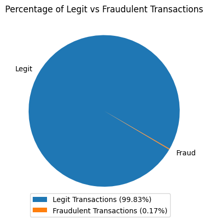
    

We can see from the pie chart above that the ratio between fraudulent and legitimate transactions is very large.

### Visualize the data

Majority of the features in the dataset (V1 - V28) are censored, meaning we do not know what the collumn represents, just its value. There are however two features we do something about. Time which is time in seconds since the first transaction in the dataset, and amount in dollars per transaction. We are now going to take a closer look at these features.

    
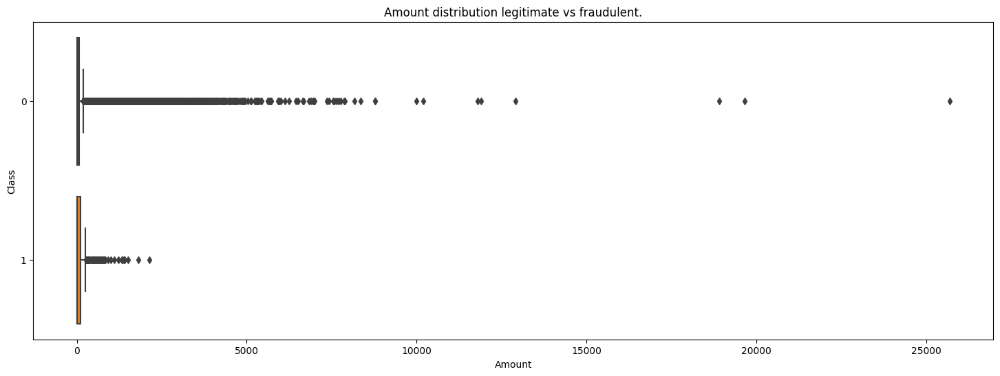
    

The boxplot above shows the distribution of the amount feature where class 1 represents fraud and class 0 represents legitimate transactions. As we you can see the legitimate transactions have more and larger outliers. This might occur because bad actors whish to keep a low profile.

Since the outliers are so large in the legitimate transactions we are not able to get a detailed view of the majority of transactions. To counter this we are going to use the same plot but remove the upper 10th percentile of the amount feature.

    203.38

    
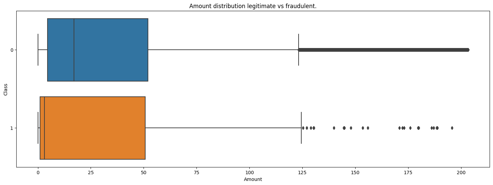
    

After removing the large outliers we get a clearer view of the distribution. The main difference between the fraud and legit case is the median amount. The median amount for the fraud case is about ~ $3 - $4 and the median amount for the legit case is about ~ $15 - $20.

We will now take a closer look at the time feature. As time in this dataset is recorded in seconds we are going to convert it into hours as it is easier to read.

    
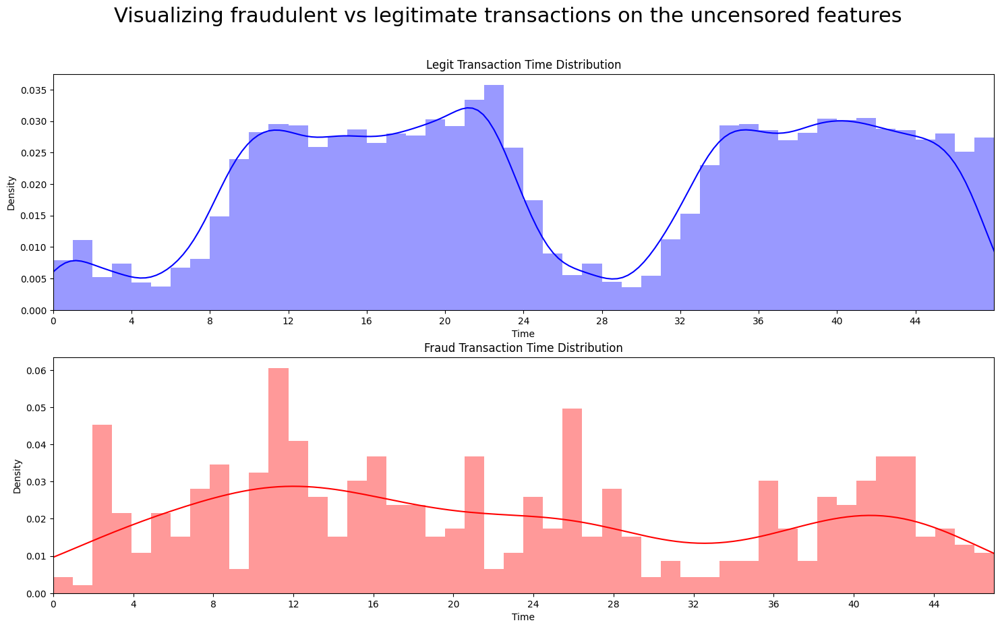
    

Here we see the distribution of the time feature of both the legit and fraud case. In the legitimate transactions we can se a wave of highs and lows, almost looking like a sine wave. This might indicate the shift from daytime to nigh time, where transactions might be less frequent during night times. The fraudulent transactions however seem to much more stable across time.

## Significant Features
### Plotting the correlation between the different features in the dataset

    
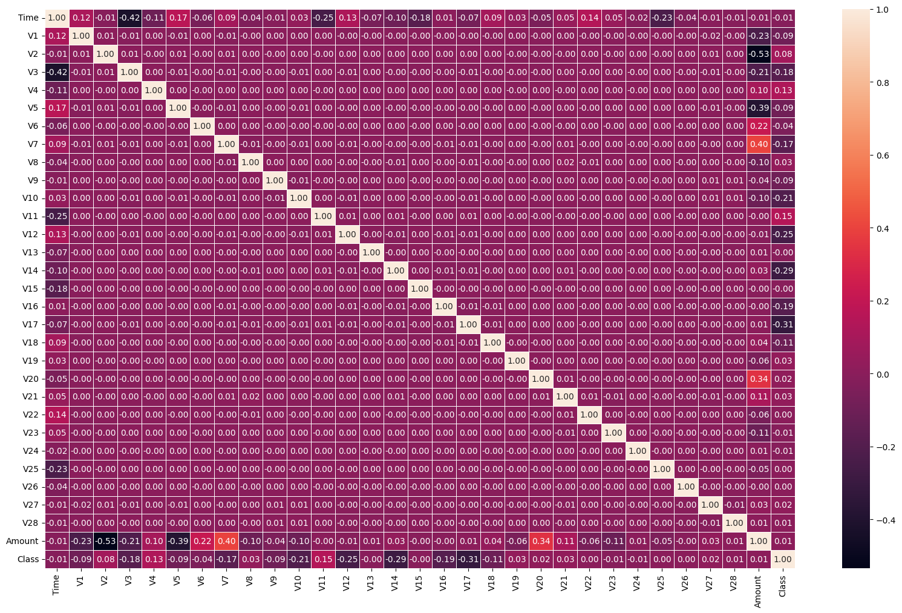
    

The heatmap above shows the correlation between each feature in dataset. The diagonal line showing all 1's are the correlations between the same feature and are therefore obviously going to be 1. In this project however we are mainly focused on the correlation between all the features and the label class.

We are therefore going to create a new plot showing only these correlations.

    
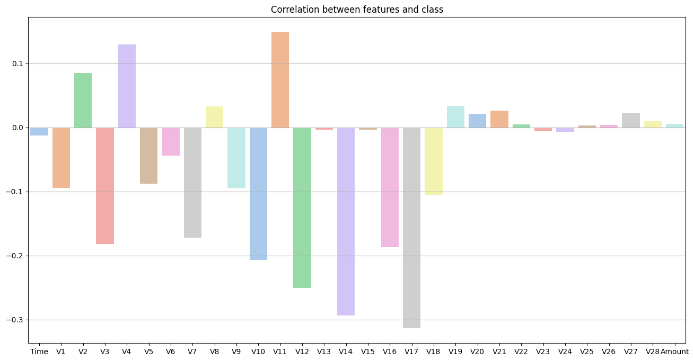
    

#### Feature inspection
Now we take a closer look at the most important features based on the bar chart above.

The features inspected are chosen using a minimum absolute value criteria of it's class correlation.

The cutoff chosen is $c_t=0.12$

    
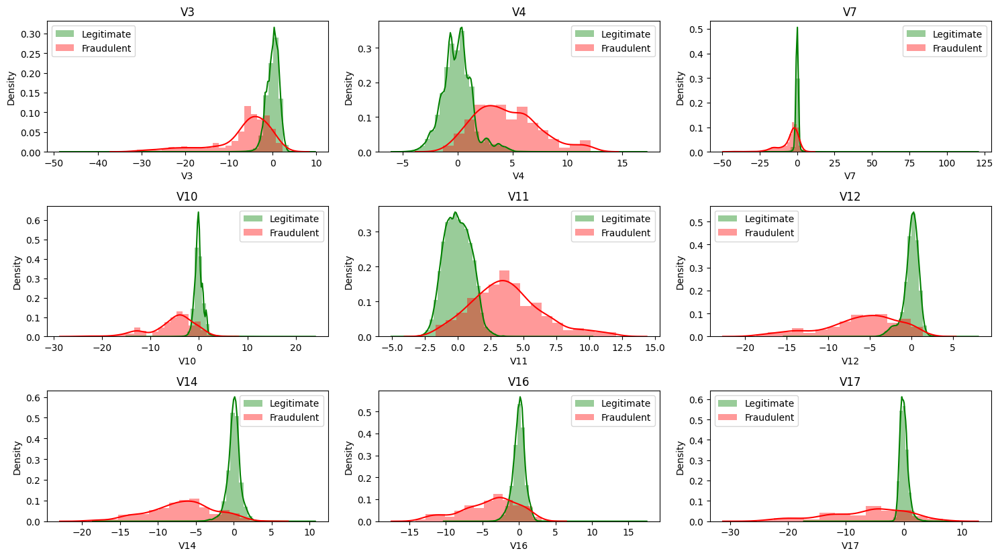
    

## Building a baseline Model

Before we start building any of our models we will start by proposing a few baseline models.
We will first take a look at the Zero Rate Classifier that proposes that we always guess for the most abundent class.

<a href="https://towardsdatascience.com/calculating-a-baseline-accuracy-for-a-classification-model-a4b342ceb88f#:~:text=Zero%20Rate%20Classifier&text=The%20ZeroR%20(or%20Zero%20Rate,just%20going%20with%20the%20odds.">Source: Zero Rate Classifier</a>

    fraud transactions vs legit: 283253, 473 
    
    Guessing for the largest class gives us a accuracy of: 99.83% 
     

However this baseline model will only ever predict the negativ class meaning no fraud occured which
in this instance is useless.

Using Weighted Guessing we can guess how many cases of class 1 and 0 appear based on the amount in the dataset.
The guesses will be proportional to how many cases there are of the classes in the dataset.
So we will guess 1, fraud 0.17% of the time and 0, legit 99.83% of the time. Percentages taken from the previous pie chart.

    Weighted guessing gives us a accuracy of: 99.67% 
    

So if you were to guess on fraud vs legit proportional to their occurences you would be right 99.66% of the time.
This is for the unbalanced dataset.

Our baseline performance on the balanced dataset for both of these methods would return 50% accuracy
as there would be a 50/50 split between fraud and legit transactions.

### Naive Bayes model 

We start off be testing the Naive Bayes classifier. This model is simple yet fast and accurate for binary classification problems. It works by taking a sum of all the features probabilites given either class. In this project we will be using the Gaussian version of the Naive Bayes model as we are dealing with continuous values, not discrete.

<a href="https://www.kdnuggets.com/2020/06/naive-bayes-algorithm-everything.html">Source: Naive Bayes</a>

We start by training a Naive Bayes model on our unprocessed data and evaluate the performance of our model.

    training score: 0.9776059564719358 
    
    test score: 0.9776548126740211 
    
    Overfitting: -4.8856202085278966e-05 
    

#### Confusion matrix plot

A confusion matrix is a description of results. It is a 2-by-2 matrix with true prognosis against predicted prognosis. Whenever a binary classification is performed, a confusion matrix will put a number to its correct and incorrect prediction. Commonly used in all fields that test for something, where the test returns posetiv or negative. 
The correct predictions are True, both posetive and negativ, and false for incorrect predictions. 

    Text(0.5, 1.0, 'Naive Bayes Model Confusion Matrix (Unbalanced)')

    
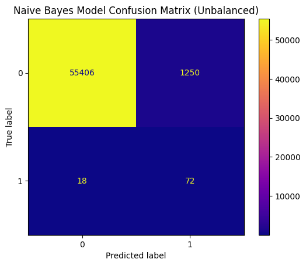
    

Here we can clearly see that the model is not accurate in its predictions regarding fraudulent transactions. This is due to overfitting. Overfitting occurs when the model is not able to generalize a "rule" from the training set and therefore is not able to accurately predict new incomming data. One of the reasons this can happen is when there are not enough data that represents a class, which in this case would be the fraud case.

<a href="https://aws.amazon.com/what-is/overfitting/">Source: Overfitting</a>

#### Classification report

    Classification Report: 
                  precision    recall  f1-score   support
    
               0       1.00      0.98      0.99     56656
               1       0.05      0.80      0.10        90
    
        accuracy                           0.98     56746
       macro avg       0.53      0.89      0.55     56746
    weighted avg       1.00      0.98      0.99     56746
    

Here we can see that the models performance when it comes to precision and recall for the positive case is very poor.

Here precision is defined as the ratio $\frac{TP}{TP + FP}$ and recall is defined as $\frac{TP}{TP + FN}$. From the CFM above this would give us: $Precision = \frac{50}{50+365} \approx 0.12$ and $Recall = \frac{50}{50+40} \approx 0.56$. The f1-score is defined as a mean combination between recall and precision. Although the model is very good at predicting negative cases, we are most interested in being able to accurately predict positive cases of fraud in this project.

<a href="https://towardsdatascience.com/a-look-at-precision-recall-and-f1-score-36b5fd0dd3ec">Source: Classification Report</a>

## Preprocessing

We will now process the data and see whether that helps our models to be better able to predict fraudulent transactions.

### Rescaling

We start off by rescaling the amount features to values between -1 and 1.

### Different upsampling methods

There are many ways to create new data from original data. Since the dataset is so unbalanced, upsampling is definately a good idea, but choosing a upsampling method is not as simple. Therefore since our problem statement is to find out how the unbalanced dataset affects the prediction models, we also need to account for different balancing methods. 

<a href="https://towardsdatascience.com/7-over-sampling-techniques-to-handle-imbalanced-data-ec51c8db349f">Source: Oversampling techniques</a>

#### Synthetic Minority Oversampling Technique (SMOTE)
This method creates new syntethic samples by utilizing a k-nearest neighbor algorithm. It basically creates samples between already existing samples, with some random element to where exactly between each datapoint it ends up being. 

<a href="https://towardsdatascience.com/7-over-sampling-techniques-to-handle-imbalanced-data-ec51c8db349f">Source: Oversampling techniques</a>

                  precision    recall  f1-score   support
    
               0       0.87      0.97      0.92     56461
               1       0.97      0.86      0.91     56841
    
        accuracy                           0.91    113302
       macro avg       0.92      0.91      0.91    113302
    weighted avg       0.92      0.91      0.91    113302
    

                  precision    recall  f1-score   support
    
               0       0.88      0.98      0.93     56534
               1       0.98      0.87      0.92     56769
    
        accuracy                           0.92    113303
       macro avg       0.93      0.92      0.92    113303
    weighted avg       0.93      0.92      0.92    113303
    

#### Borderline SMOTE

This method is similar to the previous, but quite simply doesn't use outlier points. It classifies the data into border and noise points, and only uses the border points to create new samples. 

<a href="https://towardsdatascience.com/7-over-sampling-techniques-to-handle-imbalanced-data-ec51c8db349f">Source: Oversampling techniques</a>

                  precision    recall  f1-score   support
    
               0       0.92      0.97      0.94     56461
               1       0.97      0.91      0.94     56841
    
        accuracy                           0.94    113302
       macro avg       0.94      0.94      0.94    113302
    weighted avg       0.94      0.94      0.94    113302
    

#### Borderline-SMOTE SVM

This method again is quite similar to the previous, except that it replaces K-nearest with SVM, to identify missclassified examples on the decision boundary.

<a href="https://machinelearningmastery.com/smote-oversampling-for-imbalanced-classification/">Source: SMOTE for Imbalanced Classification with Python</a>

                  precision    recall  f1-score   support
    
               0       0.94      0.98      0.96     56461
               1       0.97      0.94      0.96     56841
    
        accuracy                           0.96    113302
       macro avg       0.96      0.96      0.96    113302
    weighted avg       0.96      0.96      0.96    113302
    

#### Adaptive Synthetic Sampling (ADASYN)

This method is a advanced version of SMOTE, which now creates more samples in the minority class where there is a lower density of samples of that class.

<a href="https://machinelearningmastery.com/smote-oversampling-for-imbalanced-classification/">Source: SMOTE for Imbalanced Classification with Python</a>

                  precision    recall  f1-score   support
    
               0       0.75      0.96      0.84     56534
               1       0.94      0.69      0.79     56769
    
        accuracy                           0.82    113303
       macro avg       0.85      0.82      0.82    113303
    weighted avg       0.85      0.82      0.82    113303
    

<table id="T_b4ee2">
  <thead>
    <tr>
      <th class="blank level0" >&nbsp;</th>
      <th id="T_b4ee2_level0_col0" class="col_heading level0 col0" >Smote method</th>
      <th id="T_b4ee2_level0_col1" class="col_heading level0 col1" >Train Accuracy</th>
      <th id="T_b4ee2_level0_col2" class="col_heading level0 col2" >Test Accuracy</th>
      <th id="T_b4ee2_level0_col3" class="col_heading level0 col3" >f1-score</th>
      <th id="T_b4ee2_level0_col4" class="col_heading level0 col4" >Recall</th>
    </tr>
  </thead>
  <tbody>
    <tr>
      <th id="T_b4ee2_level0_row0" class="row_heading level0 row0" >3</th>
      <td id="T_b4ee2_row0_col0" class="data row0 col0" >svmSmote</td>
      <td id="T_b4ee2_row0_col1" class="data row0 col1" >0.956558</td>
      <td id="T_b4ee2_row0_col2" class="data row0 col2" >0.956108</td>
      <td id="T_b4ee2_row0_col3" class="data row0 col3" >0.955411</td>
      <td id="T_b4ee2_row0_col4" class="data row0 col4" >0.937316</td>
    </tr>
    <tr>
      <th id="T_b4ee2_level0_row1" class="row_heading level0 row1" >2</th>
      <td id="T_b4ee2_row1_col0" class="data row1 col0" >borderlineSmote</td>
      <td id="T_b4ee2_row1_col1" class="data row1 col1" >0.943354</td>
      <td id="T_b4ee2_row1_col2" class="data row1 col2" >0.942243</td>
      <td id="T_b4ee2_row1_col3" class="data row1 col3" >0.940653</td>
      <td id="T_b4ee2_row1_col4" class="data row1 col4" >0.912387</td>
    </tr>
    <tr>
      <th id="T_b4ee2_level0_row2" class="row_heading level0 row2" >1</th>
      <td id="T_b4ee2_row2_col0" class="data row2 col0" >kmeansSmote</td>
      <td id="T_b4ee2_row2_col1" class="data row2 col1" >0.923788</td>
      <td id="T_b4ee2_row2_col2" class="data row2 col2" >0.923303</td>
      <td id="T_b4ee2_row2_col3" class="data row2 col3" >0.918832</td>
      <td id="T_b4ee2_row2_col4" class="data row2 col4" >0.866424</td>
    </tr>
    <tr>
      <th id="T_b4ee2_level0_row3" class="row_heading level0 row3" >0</th>
      <td id="T_b4ee2_row3_col0" class="data row3 col0" >smote_standard</td>
      <td id="T_b4ee2_row3_col1" class="data row3 col1" >0.917055</td>
      <td id="T_b4ee2_row3_col2" class="data row3 col2" >0.914379</td>
      <td id="T_b4ee2_row3_col3" class="data row3 col3" >0.909364</td>
      <td id="T_b4ee2_row3_col4" class="data row3 col4" >0.856178</td>
    </tr>
    <tr>
      <th id="T_b4ee2_level0_row4" class="row_heading level0 row4" >4</th>
      <td id="T_b4ee2_row4_col0" class="data row4 col0" >adasyn</td>
      <td id="T_b4ee2_row4_col1" class="data row4 col1" >0.823351</td>
      <td id="T_b4ee2_row4_col2" class="data row4 col2" >0.821867</td>
      <td id="T_b4ee2_row4_col3" class="data row4 col3" >0.794213</td>
      <td id="T_b4ee2_row4_col4" class="data row4 col4" >0.686061</td>
    </tr>
  </tbody>
</table>

    
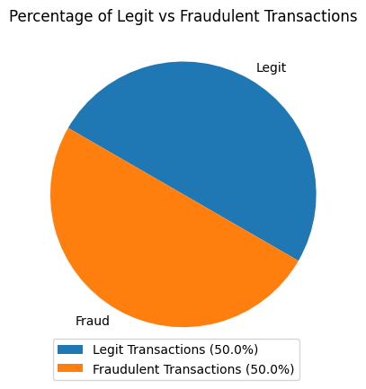
    

As we can see after upsampling the fraudulent cases the dataset is now balanced at a 50/50 ratio between fraud and legit transactions.

    
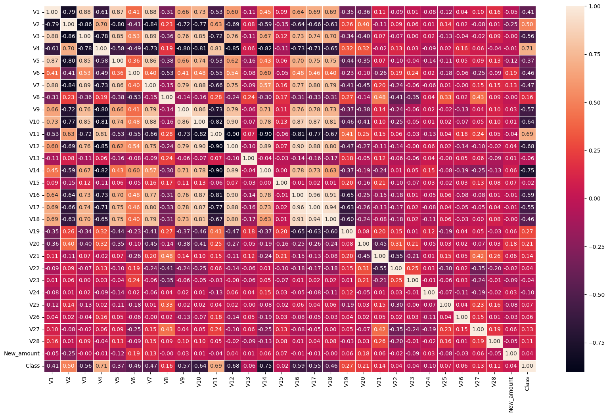
    

The heatmap above displays the new correlation between each feature after using the SMOTE upsampling

    
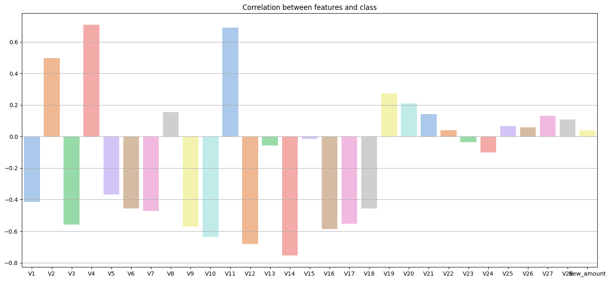
    

Showing the correlation between all the features and Class of the balanced dataset.

    training score: 0.9122117192257791 
    
    test score: 0.9126052496866781 
    
    Overfitting: -0.00039353046089896093 
    

    Text(0.5, 1.0, 'Naive Bayes Model Confusion Matrix (balanced)')

    
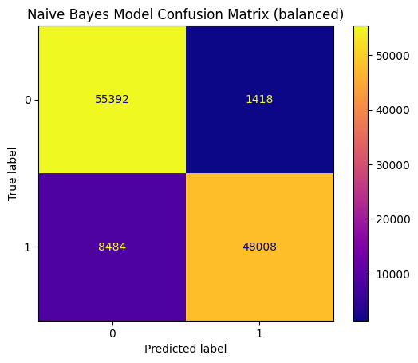
    

    Classification Report: 
                  precision    recall  f1-score   support
    
               0       0.87      0.98      0.92     56810
               1       0.97      0.85      0.91     56492
    
        accuracy                           0.91    113302
       macro avg       0.92      0.91      0.91    113302
    weighted avg       0.92      0.91      0.91    113302
    

Here we can already see a dramatic increase in both precision, recall and f1-score for the positive case of fraud (0.91 f1-score compared to 0.2 on the unbalanced set). 

## K Nearest Neighbor
The KNN model is described as a more simple and lazy model for machine learning. It workes best for binary classification and smaller datasets.

The basic explanation for this model, is to group datapoints into differnet groups based on their attributes. Datapoints with similar attribute values are classified togheter, calculated by how near a datapoint is to its neighbors. The amount of neighbours to check is the K-factor, and there are different approaches to finding an optimal k-factor. 

Our dataset is binary, but quite large for this model.

<a href="https://scikit-learn.org/stable/modules/neighbors.html#classification">Source: SKLearn KNN</a>

    
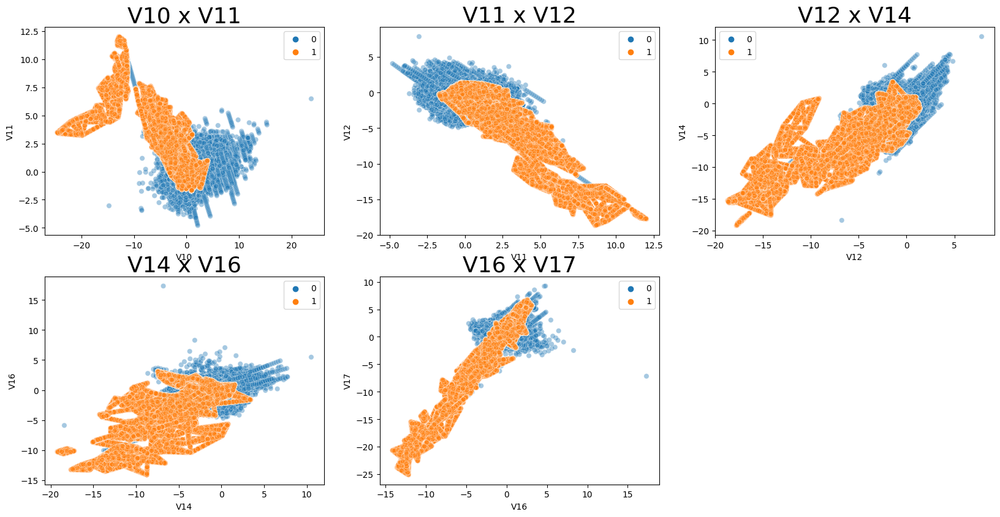
    

The scatterplots for the balanced data show some distinctions between frauds and legit transactions, but also a lot of overlap. 

This can prove to be a difficult aspect for the KNN model, given that the two groups are not so clearly defined.

### Reducing the dataset

KNN generally works well with small datasets, but its performance decreases exponentially with the amount of input features. In our dataset we utilize 29 features for determining the following class of said features. This in turn makes the KNN very slow compared to other models.

The dataset we are using could be too large for this somewhat simple algorithm. Therefore we select a smaller subset:
Using .iloc to select the subset.

<a href="https://www.i2tutorials.com/why-cannot-we-use-knn-for-large-datasets/">Source: KNN-Problematic</a>

### K-Factors
 We tried different k-factors, and plotted their respective accuracy.

    
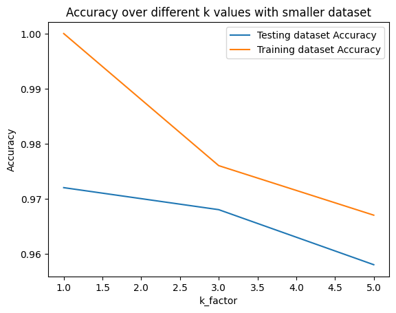
    

The model gives the best accuracy with a k-factor of 1, so that is the value that will be used from here on out.

#### Performance

    Text(0.5, 1.0, 'KNN-short Model Confusion Matrix ')

    
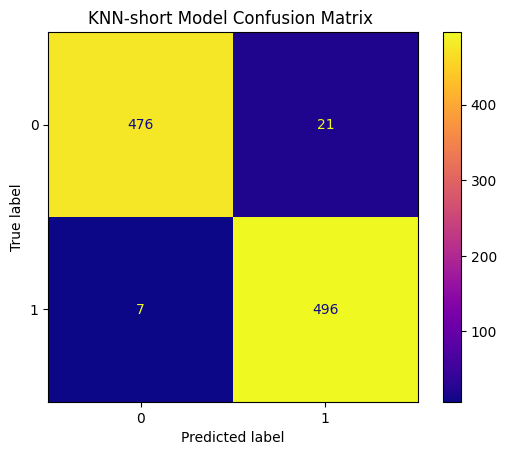
    

#### Classification Report

    Classification Report for KNN model: 
                  precision    recall  f1-score   support
    
               0       0.99      0.96      0.97       497
               1       0.96      0.99      0.97       503
    
        accuracy                           0.97      1000
       macro avg       0.97      0.97      0.97      1000
    weighted avg       0.97      0.97      0.97      1000
    

### KNN model on original data
If could be the case that the balanced dataset lack clear differences, so we will try with the original data.

#### Scatterplot for original data
Using the scatterplot once again, to see if there is any clear differentses.

    
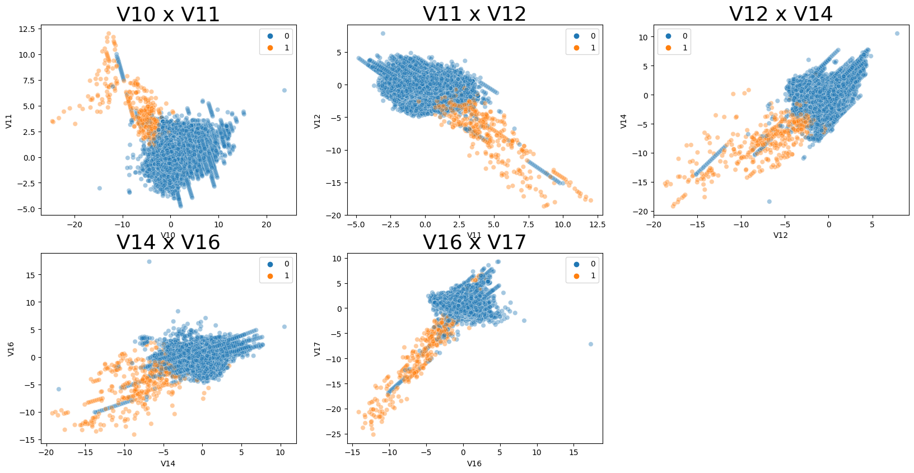
    

The most distinct features show clear grouping for the legit class, but the fraud class is more spread out. This works in favour of the KNN model.

### Performance

    Text(0.5, 1.0, 'KNN Model Confusion Matrix for Original Data ')

    
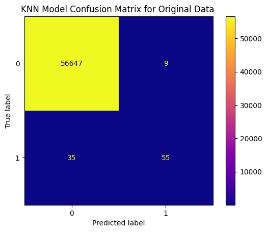
    

    Classification Report for KNN model: 
                  precision    recall  f1-score   support
    
               0       1.00      1.00      1.00     56656
               1       0.86      0.61      0.71        90
    
        accuracy                           1.00     56746
       macro avg       0.93      0.81      0.86     56746
    weighted avg       1.00      1.00      1.00     56746
    

#### KNN Conclusion

The small balanced dataset performed well, probabaly because there were some many datapoints for each class.

The original data performed worse, even though the scatterplot showed a more clear difference in grouping. This is likely because the imbalance between the classes gave a bias in favour of legit transactions. There were way more false negatives than false positives.

This classification model does not work well with such an imbalanced dataset.

## Neural Network Model

### Get clean start for all data

### Use borderline SMOTE SVM to upsample

### Split into training and test data

### Train a neural network
This neural network has 1 input layer, 3 hidden layers & 1 output layer. The layers is of the following sizes: 30x60x30x10x1. The number of neurons and hidden layers is choosen experimentally with different epoch parameters, below is the result.
##### EPOCHS = 5
        29, 16, 1 -> 0.9991, 0.9991
        29, 1 -> 0.9988, 0.9989
        58, 29, 1 -> 0.9993 , 0.9994
        116, 58, 29, 1 -> 0.9994 , 0.9995
        232, 116, 58, 29, 1 -> 0.9994 , 0.9996

    Model: "sequential_1"
    _________________________________________________________________
     Layer (type)                Output Shape              Param #   
    =================================================================
     dense_4 (Dense)             (None, 60)                1860      
                                                                     
     dense_5 (Dense)             (None, 30)                1830      
                                                                     
     dense_6 (Dense)             (None, 10)                310       
                                                                     
     dense_7 (Dense)             (None, 1)                 11        
                                                                     
    =================================================================
    Total params: 4,011
    Trainable params: 4,011
    Non-trainable params: 0
    _________________________________________________________________
    Epoch 1/5
    12795/12795 [==============================] - 32s 2ms/step - loss: 0.0118 - accuracy: 0.9975 - val_loss: 0.0050 - val_accuracy: 0.9994
    Epoch 2/5
    12795/12795 [==============================] - 31s 2ms/step - loss: 0.0043 - accuracy: 0.9993 - val_loss: 0.0040 - val_accuracy: 0.9994
    Epoch 3/5
    12795/12795 [==============================] - 34s 3ms/step - loss: 0.0036 - accuracy: 0.9994 - val_loss: 0.0031 - val_accuracy: 0.9994
    Epoch 4/5
    12795/12795 [==============================] - 28s 2ms/step - loss: 0.0031 - accuracy: 0.9995 - val_loss: 0.0036 - val_accuracy: 0.9994
    Epoch 5/5
    12795/12795 [==============================] - 31s 2ms/step - loss: 0.0026 - accuracy: 0.9996 - val_loss: 0.0033 - val_accuracy: 0.9995

    3554/3554 [==============================] - 5s 1ms/step
    pred: [[1]
     [1]
     [1]
     ...
     [0]
     [0]
     [1]], test:         Class
    484657      1
    409771      1
    419226      1
    89221       0
    365095      1
    ...       ...
    518178      1
    116382      0
    183607      0
    21832       0
    556418      1
    
    [113726 rows x 1 columns]

    
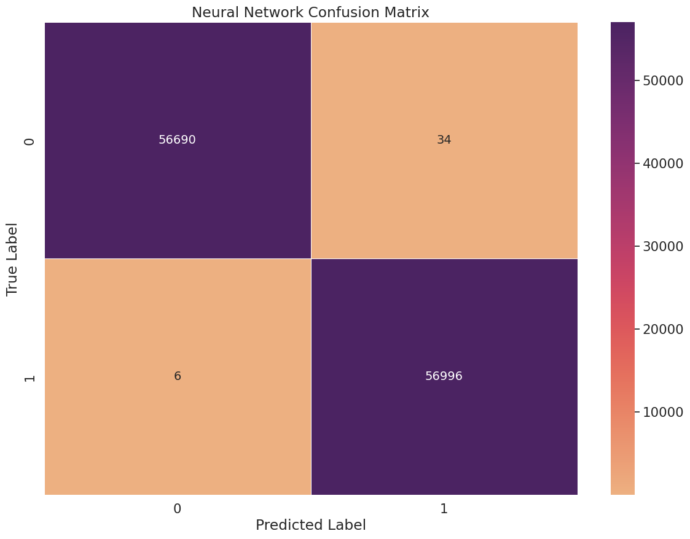
    

    3554/3554 [==============================] - 4s 1ms/step
    3554/3554 [==============================] - 5s 1ms/step
    3554/3554 [==============================] - 6s 2ms/step - loss: 0.0023 - accuracy: 0.9996

    8901/8901 [==============================] - 11s 1ms/step
    pred: [[0]
     [0]
     [0]
     ...
     [0]
     [0]
     [0]], test: 0         0
    1         0
    2         0
    3         0
    4         0
             ..
    284802    0
    284803    0
    284804    0
    284805    0
    284806    0
    Name: Class, Length: 284807, dtype: int64
            0    1
    0  284164  151
    1      47  445
    Recall = 0.9044715447154471

    
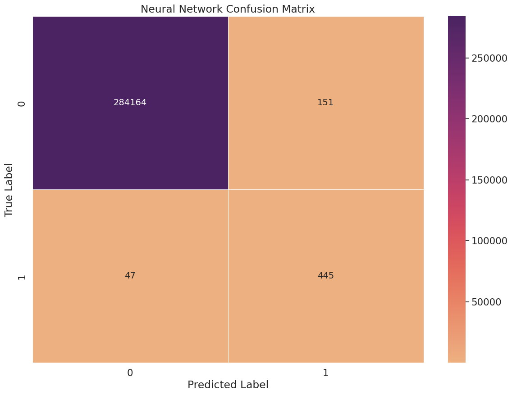
    

                  precision    recall  f1-score   support
    
               0       1.00      1.00      1.00    284315
               1       0.75      0.90      0.82       492
    
        accuracy                           1.00    284807
       macro avg       0.87      0.95      0.91    284807
    weighted avg       1.00      1.00      1.00    284807
    

## Conclusion
Looking back at the difference between the neural network's f1-score using upsampled data and the original data for training, which then both tried to predict all of the original set, it can be observed that the more balanced albeit artificial dataset is better for training the classifier, even when only performing predictions the original dataset. 

This is a direct answer to our research question. This result fits the expected outcome of the models based on our dataset's content.

<table id="T_68e97">
  <thead>
    <tr>
      <th class="blank level0" >&nbsp;</th>
      <th id="T_68e97_level0_col0" class="col_heading level0 col0" >Model</th>
      <th id="T_68e97_level0_col1" class="col_heading level0 col1" >Train Score</th>
      <th id="T_68e97_level0_col2" class="col_heading level0 col2" >Test Score</th>
      <th id="T_68e97_level0_col3" class="col_heading level0 col3" >f1-score</th>
      <th id="T_68e97_level0_col4" class="col_heading level0 col4" >Recall Score</th>
    </tr>
  </thead>
  <tbody>
    <tr>
      <th id="T_68e97_level0_row0" class="row_heading level0 row0" >3</th>
      <td id="T_68e97_row0_col0" class="data row0 col0" >Neural network</td>
      <td id="T_68e97_row0_col1" class="data row0 col1" >0.997521</td>
      <td id="T_68e97_row0_col2" class="data row0 col2" >0.999648</td>
      <td id="T_68e97_row0_col3" class="data row0 col3" >0.999649</td>
      <td id="T_68e97_row0_col4" class="data row0 col4" >0.999895</td>
    </tr>
    <tr>
      <th id="T_68e97_level0_row1" class="row_heading level0 row1" >2</th>
      <td id="T_68e97_row1_col0" class="data row1 col0" >Neural network</td>
      <td id="T_68e97_row1_col1" class="data row1 col1" >0.998017</td>
      <td id="T_68e97_row1_col2" class="data row1 col2" >0.999288</td>
      <td id="T_68e97_row1_col3" class="data row1 col3" >0.999290</td>
      <td id="T_68e97_row1_col4" class="data row1 col4" >0.999895</td>
    </tr>
    <tr>
      <th id="T_68e97_level0_row2" class="row_heading level0 row2" >1</th>
      <td id="T_68e97_row2_col0" class="data row2 col0" >K nearest neighbour</td>
      <td id="T_68e97_row2_col1" class="data row2 col1" >1.000000</td>
      <td id="T_68e97_row2_col2" class="data row2 col2" >0.972000</td>
      <td id="T_68e97_row2_col3" class="data row2 col3" >0.972549</td>
      <td id="T_68e97_row2_col4" class="data row2 col4" >0.986083</td>
    </tr>
    <tr>
      <th id="T_68e97_level0_row3" class="row_heading level0 row3" >0</th>
      <td id="T_68e97_row3_col0" class="data row3 col0" >Naive Bayes</td>
      <td id="T_68e97_row3_col1" class="data row3 col1" >0.912212</td>
      <td id="T_68e97_row3_col2" class="data row3 col2" >0.912605</td>
      <td id="T_68e97_row3_col3" class="data row3 col3" >0.906513</td>
      <td id="T_68e97_row3_col4" class="data row3 col4" >0.849819</td>
    </tr>
  </tbody>
</table>

From the table above we can see that the neural network outperforms the other classifiers on every metric.
